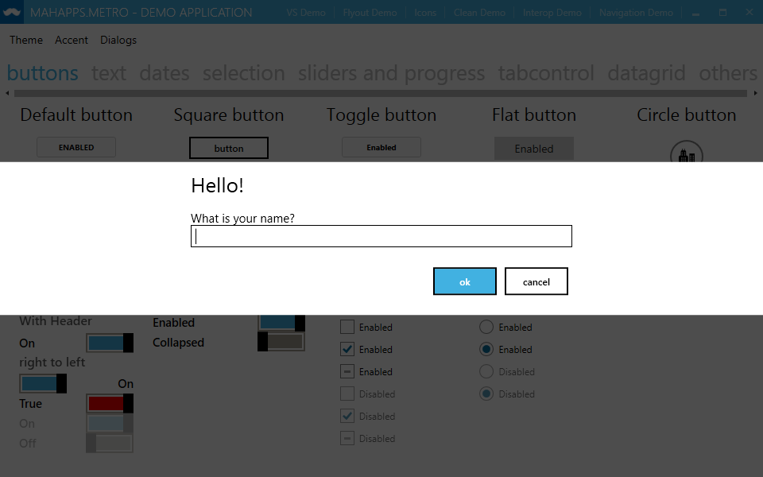

Title: Dialogs
---

Since the built-in WPF dialogs are unstyleable, we had to create our own implementation. You will find our dialogs within the MahApps.Metro.Controls.Dialogs namespace.

All dialogs in MahApps.Metro are called asynchronously. This means that you can use the `async / await` keywords to use the methods and call the dialogs.

# Message Dialog

Simple message dialogs can be displayed with the `ShowMessageAsync` method. It is an extension method for `MetroWindow`, so call it from your window class.

```csharp
private async void OnButtonClick(object sender, RoutedEventArgs e)
{
  await this.ShowMessageAsync("This is the title", "Some message");
}
```

# Input Dialog



# Login Dialog


# Progress Dialog

There is a built-in dialog that displays a progress bar at the bottom of the dialog. Call it like this:

```csharp
var controller = await this.ShowProgressAsync("Please wait...", "Progress message");
```
    
This method returns a `ProgressDialogController` object that exposes the `SetProgress` method, use it to set the current progress.

A picture of the progress dialog in the demo:


# Support MVVM with the DialogCoordinator

You can open dialogs from your ViewModel by using the `DialogCoordinator`.

There’s a couple of simple things you have to do:

1. Use the `DialogParticipation.Register` attached property in your Window to register your ViewModel with the dialog sub-system.

Assuming your View’s DataContext is set to the ViewModel from where you want to launch the dialog, add these attributes:

```xml
<mah:MetroWindow x:Class="SimpleApp.MainWindow"
                 xmlns:mah="clr-namespace:MahApps.Metro.Controls;assembly=MahApps.Metro"
                 xmlns:Dialog="clr-namespace:MahApps.Metro.Controls.Dialogs;assembly=MahApps.Metro"
                 Dialog:DialogParticipation.Register="{Binding}">

</mah:MetroWindow>
```

2. Grab & use the `DialogCoordinator` to open dialogs.

You can instantiate `DialogCoordinator` directly, or, good citizens will probably want to inject in the interface `IDialogCoordinator` into their ViewModel.  This will play nicely with TDD, and is agnostic to whatever DI framework you may be using.

Without a DI framework you could just do something like this:

```csharp
using MahApps.Metro.Controls;
using MahApps.Metro.Controls.Dialogs;

namespace SimpleApp
{
    public class MainWindow : MetroWindow
    {
        public MainWindow()
        {
            this.InitializeComponent();

            // Set the DataContext for your View
            this.DataContext = new MainWindowViewModel(DialogCoordinator.Instance);
        }
    }
}
```

Opening up a dialog from your ViewModel is now easy, using the IDialogCoordinator instance.  To most methods the first parameter named “context” will typically be your ViewModel.  This is how the coordinator will match the ViewModel to the window (with what was registered in step 1) and display the dialog.  If you have multiple windows open, the dialog will display on the correct window.  Show your dialog from inside your ViewModel just like this:

```csharp
using MahApps.Metro.Controls.Dialogs;

namespace SimpleApp
{
    public class MainWindowViewModel
    {
        // The DialogCoordinator
        private IDialogCoordinator dialogCoordinator;

        public MainWindowViewModel(IDialogCoordinator instance)
        {                    
            this.dialogCoordinator = instance;
        }

        // Simple method which can be used on a Button
        public async void FooMessage()
        {
            await this.dialogCoordinator.ShowMessageAsync(this, "Message Title", "Bar");
        }
        
        public async void FooProgress()
        {
            // Show...
            ProgressDialogController controller = await this.dialogCoordinator.ShowProgressAsync(this, "Wait", "Waiting for the Answer to the Ultimate Question of Life, The Universe, and Everything...");

            controller.SetIndeterminate();
            
            // Do your work... 
            var result = await Task.Run(...);
             
            // Close...
            await controller.CloseAsync();
        }
    }
}
```

# MetroDialogSettings

# LoginDialogSettings

# Color Scheme

# Custom Dialogs
