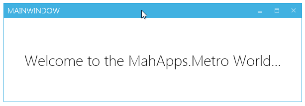

Order: 10
Title: MetroWindow
---

The `MetroWindow` is the main entry point of `MahApps` and replaces the normal `Window` to get the `MahApps` styles and themes to be work.  

If you don't know how to start with this one then you can go to the [Quick Start](/docs/guides/quick-start) section.  

# Window borders

The `MetroWindow` can be used with different borders. You can change it by using the `BorderBrush`, `GlowBrush` and `BorderThickness`.

# Normal Border

```xml
<Controls:MetroWindow x:Class="MahApps.Metro.Simple.Demo.MainWindow"
                      xmlns="http://schemas.microsoft.com/winfx/2006/xaml/presentation"
                      xmlns:x="http://schemas.microsoft.com/winfx/2006/xaml"
                      xmlns:Controls="http://metro.mahapps.com/winfx/xaml/controls"
                      Title="MainWindow"
                      Height="200"
                      Width="600"

                      BorderBrush="{DynamicResource AccentColorBrush}"
                      BorderThickness="1"

                      WindowStartupLocation="CenterScreen">

</Controls:MetroWindow>
```



# Glow Border

```xml
<Controls:MetroWindow x:Class="MahApps.Metro.Simple.Demo.MainWindow"
                      xmlns="http://schemas.microsoft.com/winfx/2006/xaml/presentation"
                      xmlns:x="http://schemas.microsoft.com/winfx/2006/xaml"
                      xmlns:Controls="http://metro.mahapps.com/winfx/xaml/controls"
                      Title="MainWindow"
                      Height="200"
                      Width="600"

                      GlowBrush="{DynamicResource AccentColorBrush}"

                      WindowStartupLocation="CenterScreen">

</Controls:MetroWindow>
```


# Only Shadow

```xml
<Controls:MetroWindow x:Class="MahApps.Metro.Simple.Demo.MainWindow"
                      xmlns="http://schemas.microsoft.com/winfx/2006/xaml/presentation"
                      xmlns:x="http://schemas.microsoft.com/winfx/2006/xaml"
                      xmlns:Controls="http://metro.mahapps.com/winfx/xaml/controls"
                      Title="MainWindow"
                      Height="200"
                      Width="600"

                      BorderThickness="0" 
                      GlowBrush="Black"
                      ResizeMode="CanResizeWithGrip"

                      WindowTransitionsEnabled="False"
                      WindowStartupLocation="CenterScreen">

</Controls:MetroWindow>
```


# Properties

One property not detailed is the `SaveWindowPosition="True|False"` (default `False`) option. Setting this property to `True` will mean on next launch, it will automatically be positioned and sized to what it was on exit. This is designed to improve UX and speed development as its one of those "plumbing" UI things that is done regularly.  

Be careful though - if a monitor is detached during application exit and restart, or if certain circumstances arise, your application may launch off screen. Be sure to provide a 'reset' option or handle that in code.
